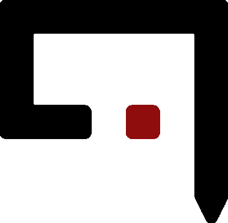

# [Deep Q Learning](https://huggingface.co/learn/deep-rl-course/en/unit3/deep-q-algorithm) for Top-Down 2D Games
- In the game of [Snake](https://en.wikipedia.org/wiki/Snake_(video_game_genre)), each time the snake eats an apple, it grows by one chunk.
- The game ends if the snake head hits a wall or its own body.


# Overview
- [**Reinforcement learning**](https://en.wikipedia.org/wiki/Reinforcement_learning) is a style of machine learning that relies on past experience to develop a **policy** on what do to next.
- [**Deep neural networks**](https://en.wikipedia.org/wiki/Deep_learning) are used in machine learning to set up decision pathways that maximize reward (i.e. **minimize loss** or error).
- [**Q-learning**](https://en.wikipedia.org/wiki/Q-learning) is a subclass of reinforcement learning that is **model-free**, meaning that it does not require a model of the environment in which it operates and can learn directly from raw experiences.

## Winning the Game
- In this exploration, a **policy** is a strategy to win the game of snake, and we want to find the optimal one.
- The **agent** executes the policy.
- The policy begins as *"move randomly and hope for the best"*.
- As the agent gains experience, the policy becomes less random and moves closer to an optimal solution.

***The more the agent plays, the more its random movements are replaced by policy-predicted movements.***

# Core Files
## `q_snake.py`
Run `python q_snake.py` to interface with this project.

## `config.json`
Define how the script should run. All of the keys in the default configuration included below are required along with their example data types.
```json
{
    "project_root_dir": ".",
    "human": true,
    "name": "test",
    "save_for_gif": false,
    "make_gif": false,
    "params":{
        "epsilon": 1.0,
        "gamma": 0.95,
        "batch_size": 256,
        "epsilon_min": 0.001,
        "epsilon_decay": 0.98,
        "learning_rate": 0.00025,
        "layer_sizes": [128, 128, 128],
        "num_episodes": 15,
        "max_steps": 15000,
        "state_definition_type": "default"
    }
}
```
### Core Param Definitions
#### `epsilon`
Initial ratio of random versus policy-predicted steps.
#### `gamma`
Discount factor for future rewards (0 is short-sighted, 1 is long-sighted).
#### `batch_size`
The number of training samples processed before the model's internal parameters are updated during one iteration of training.
#### `epsilon_min`
The minimum ratio of time steps we'd like the agent to move randomly vs in a predicted direction.
#### `epsilon_decay`
How much of the ratio of random moving we want to take into the next iteration of gathering a batch of states.
#### `learning_rate`
To what extent newly acquired info overrides old info (0 learn nothing and exploit prior knowledge exclusively; 1 only consider the most recent information)
#### `layer_sizes`
The number of nodes for the hidden layers of our Q network
#### `num_episodes`
The number of games to play.
#### `max_steps`
The maximum number of steps allowable in a single game.

### An Important Note on `batch_size`
- The number of training examples used in the *estimate* of the **error gradient** is a *hyperparameter* for the learning algorithm called the **"batch size"** (or simply **"the batch"**).
- Note that the error gradient is a *statistical* estimate.
- The more training examples used in the estimate:
  1. The more accurate the estimate will be.
  2. The more likely the network will adjust such that the model's overall performance improves.
- **An improved estimate of the error gradient comes at a cost**: it requires the model to make many more predictions before the estimate can be calculated and the weights updated.

#### Notes Batch Size from Deep Learning by Ian Goodfellow:
>"Optimization algorithms that use the entire training set are called batch or deterministic gradient methods, because they process all of the training examples simultaneously in a large batch."
>
>"Optimization algorithms that use only a single example at a time are sometimes called stochastic or sometimes online methods. The term online is usually reserved for the case where the examples are drawn from a stream of continually created examples rather than from a fixed-size training set over which several passes are made."

#### Notes Batch Sizing from Jason Brownlee:
> A batch size of 32 means that 32 samples from the training dataset will be used to estimate the error gradient before the model weights are updated. One training epoch means that the learning algorithm has made one pass through the training dataset, where examples were separated into randomly selected 'batch size' groups.
>
> Historically, a training algorithm where the batch size is set to the total number of training examples is called 'batch gradient descent' and a training algorithm where the batch size is set to 1 training example is called 'stochastic gradient descent' or 'online gradient descent.'"
>
> Put another way, the batch size defines the number of samples that must be propagated through the network before the weights can be updated.

#### Summary of Batch Sizing Styles
| Gradient Descent Type           | Batch Size                            |
|---------------------------------|---------------------------------------|
| **Batch Gradient Descent**      | all training samples                  |
| **Stochastic Gradient Descent** | 1                                     |
| **Minibatch Gradient Descent**  | 1 < batch size < all training samples |

## `requirements.txt`
After creating a virtual environment with [Python 3.12.4](https://www.python.org/downloads/release/python-3124/), run `pip install -r requirements.txt` to install all necessary dependencies.

## `environment.py`
This subclass of `gymnasium.Env` represents the snake game environment.

## `agent.py`
Train an agent to play snake via a deep Q-learning network.

## `plotting.py`
Graph some statistics about how the Q-network was trained and the performance of the agent.

## `gif_builder.py`
Convert saved eps files into png files and then png files into an animated gif. Using this class requires a separate installation of [Ghostscript](https://ghostscript.com/releases/index.html).

## `make_gif_from_images.py`
Convert already-saved eps or png image files into a gif without having to re-run the game. Again, [Ghostscript](https://ghostscript.com/releases/index.html) is required.

# Setup
If you are fairly new to Python programming, I'd reccommend the following steps:

1. Download and install [VS Code](https://code.visualstudio.com/download).

2. Install [Python 3.12.4](https://www.python.org/downloads/release/python-3124/) (add it to PATH if you have no other Python versions installed).

3. Install [Git bash](https://git-scm.com/downloads).

4. *OPTIONAL:* If you want to utilize the gif-making supporting scripts, install [Ghostscript](https://ghostscript.com/releases/index.html) and note the path of the binary. You will need to change a line in the preamble of **gif_creator.py** to specify where the binary is located.

5. Open VS Code, and from the Git bash shell, run `pip install virtualenv` to install the `virtualenv` module.

6. Run `python -m virtualenv <myenvname> --python=python3.12.4` to create a virtual environment that runs on Python 3.12.4.

7. In your shell, navigate to the main project folder that contains `<myenvname>` via `cd <projdir>`. You can confirm the environment folder exists with a quick `ls -la` command.

8. Activate the virtualenvironment with `source <myenvname>/bin/activate`.

9.  You should see a `(<myenvname>)` string next to the terminal input when the environment is active.

10. Press `Ctrl+Shift+P` to open VS Code's command palette.

11. From the dropdown menu, click `Python: Select Interpreter`.

12. Select `Python 3.12.4 64-bit ('<myenvname>':venv)`.

13. Run `pip list` to see a list of installed packages. It should only have two or three modules.

14. Run `pip install -r requirements.txt` to install all dependencies on your activated virtual environment.

15. Once everything is installed, run `python q_snake.py` to test if you can play the game manually.

16. Next, specify `"human": false` in `config.json`, save it, and then run  `python q_snake.py` again, this time to see if the *agent* is able to play the game.

17. Let the agent run to the end and check that `plotting.py` is able to produce a graph of the learning curve.

18. Play with a few settings in `config.json` and re-run `python q_snake.py` to see how the changes affect the agent's behavior. Feel free to do this until you get bored or it sparks a questions you want to explore.

19. OPTIONAL - If you were bold enough to install Ghostscript, try saving game frames as eps files. You can then run `make_gif_from_images.py` (with some manual adjustments) to convert the eps files into png files and then into an animated gif.

20. OPTIONAL - Try converting the saved eps files into png and then into a gif all at once by specifying `"save_for_gif": true` and `"make_gif": true` in config.json. Please note that this process can take ~30 minutes for 50 training episodes.

# Q-Learning Overview
## What is the [Bellman Equation](https://en.wikipedia.org/wiki/Bellman_equation)?

The Bellman equation is a fundamental recursive formula in reinforcement learning that expresses the value (i.e. Q-value) of a **state** in terms of the expected reward and the values of subsequent states. It has an abstract general definition, but in Q-learning, it's more easily understood when rearranged into the [**Q-value update rule**](https://en.wikipedia.org/wiki/Q-learning#Algorithm).

$$Q^{\mathrm{new}}(s_t, a_t) \leftarrow \underbrace{Q(s_t, a_t)}_{\mathrm{old\,value}} + \underbrace{\alpha}_{\mathrm{learning\ rate}} \cdot \overbrace{\left(\underbrace{\underbrace{r_t}_{\mathrm{reward}} + \underbrace{\gamma}_{\mathrm{discount}} \cdot \underbrace{\underset{a}{\max}\ Q(s_{t+1},a)}_{\mathrm{est.\ optimal\ future\ value}}}_{\mathrm{new\ value\ (temporal\ difference\ target)}} -\;\underbrace{Q(s_t, a_t)}_{\mathrm{old\,value}}\right)}^{\mathrm{temporal\ difference}}$$

- $Q(s_t,a_t)$ is the Q-value of taking action $a$ in state $s$ at time $t$.
- $\alpha$ is the learning rate, which determines the extent to which new experience overrides past experience.
- $r_t$ is the immediate reward received after taking action $a$ in state $s$ at time $t$.
- $\gamma$ is the discount factor, which balances the importance of immediate versus future rewards.
- $s_{t+1}$ is the next state resulting from taking action $a$ in state $s$ at time $t$.
- $\underset{a}{\max}\,Q(s_{t+1},a)$ is the maximum Q-value for the next state $s_{t+1}$ over all possible actions.

An episode of the algorithm ends when state $s_{t+1}$ is a **final** state. For all final states $s_f$, $Q(s_f,a)$ is never updated, but is instead set to the reward value $r$ observed for state $s_f$.

### Adjustable Hyperparameters
#### 1. The _**learning rate**_, $\alpha$, where $\alpha\in(0,1]$.
   1. $\alpha$ determines _**to what extent newly acquired information overrides old information**_. A factor of 0 makes the agent exclusively use prior knowledge, whereas 1 makes it consider only the most recent data. In deterministic environments, a value of 1 is optimal, but when there is randomness involved, it needs to eventually decrease to zero (meaning an optimal strategy is found). In practice, however, using a constant learning rate works just fine.
#### 2. The _**discount factor**_, $\gamma$, where $\gamma\in(0,1]$.
   1. $\gamma$ determines the _**importance of future rewards**_.
      1. 0 makes the agent short-sighted, whereas 1 makes it strive for a long-term, larger reward.
      2. Starting with a small discount factor and increasing it toward a final value over time tends to accelerate learning.

## Applying the Bellman Equation to Snake
In the Snake game, the agent (the snake) navigates the game grid, eats food to grow, and avoids collisions with itself and the walls.
### General Definitions in Terms of Snake
- State $s$
  - A configuration of the game (i.e. the position of the snake the food).
- Action $a$
  - Possible moves (i.e. up, down, left, or right).
- Reward $r$
  - The reward received for taking action $a$ in state $s$.
    | **Reward Type** | **Description**                              |
    |-----------------|----------------------------------------------|
    | +               | Reward for eating food                      |
    | -               | Penalty for colliding with walls or itself  |
    | 0               | No reward for moving without eating food    |

### Bellman Snake Algorithm
1. Initialize DQN
   - Start with an empty neural net where all Q-values are zero.
2. Observe Current State $s$
   - Record the current position of the snake and the apple on the grid.
3. Choose Action $a$
   - Choose to act based more on past experience or for random exploration (based on $\epsilon$, another hyperparameter set in `config.json` under `epsilon_decay`).
4. Execute Action and Observe Reward
   - Take the action $a$, move the snake, then receive the immediate reward $r$.
5. Observe Next State
   - Record the new position of the snake and the apple on the grid.
6. Update Q-Value
   - Apply the Bellman equation to update the Q-value for the state-action pair $(s, a)$
7. Iterate
   - Repeat the process, updating the weights in the DQN as the agent continues to play.
____
## To Dev

- ~~Allow for several user-definable agents via **config.json** files.~~

- ~~Clean up **plotting.py** and add the ability to save figures locally.~~

- ~~Add hyperparameter settings to the learning curve figure generated by **plotting.py**.~~

- ~~Expand **README.md** to include a high-level overview of how the network is trained via a **Bellman equation**.~~

- **Allow for models to be saved.**

- **Allow previously trained models to play with saved settings.**

- **Allow previously trained models to play and resume training.**

- ~~Expand **plotting.py** to store a hyperparameter configuration's collection of training episodes as a gif.~~
____
## References
1. [Create a Snake-Game using Turtle in Python](https://www.geeksforgeeks.org/create-a-snake-game-using-turtle-in-python/)
2. [Q-learning](https://en.wikipedia.org/wiki/Q-learning)
3. [Bellman equation](https://en.wikipedia.org/wiki/Bellman_equation)
4. [Snake Played by a Deep Reinforcement Learning Agent](https://towardsdatascience.com/snake-played-by-a-deep-reinforcement-learning-agent-53f2c4331d36)
5. [OpenAI's `Env` class in `gym.gym.core`](https://github.com/openai/gym/blob/master/gym/core.py)
6. [OpenAI's `classic_control` examples](https://github.com/openai/gym/tree/master/gym/envs/classic_control)
7. [Playing Atari with Deep Reinforcement Learning](https://arxiv.org/pdf/1312.5602.pdf)